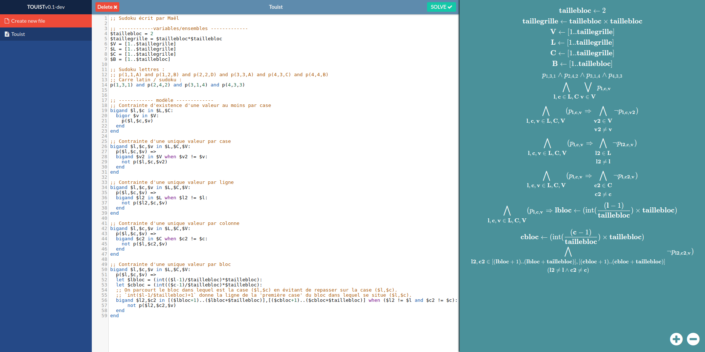

Touist editor
======

A simple browser based ide for [Touist](https://github.com/touist/touist)



### Installation
```git clone https://github.com/graphman65/touist-editor```

### Requirements
- [Docker](https://www.docker.com/)
- [docker-compose](https://docs.docker.com/compose/)

### How to
```docker-compose up```

### Development
```docker-compose -f docker-compose.dev.yml up```
